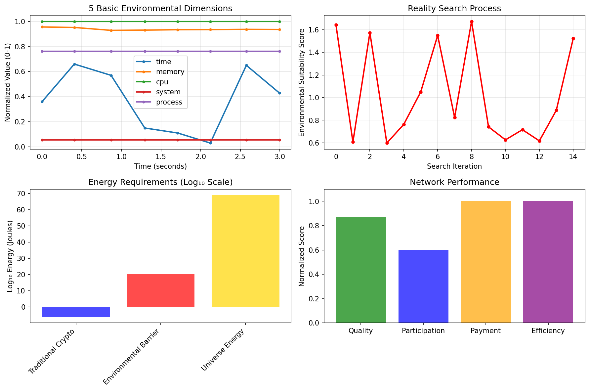
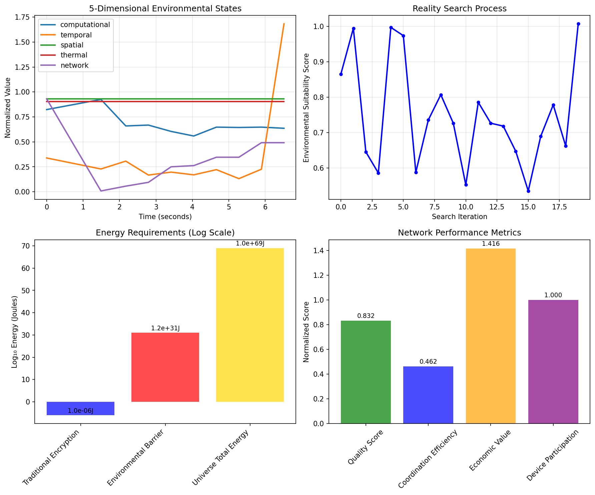

<h1 align="center">Mzekezeke</h1>
<p align="center"><em> Consenquences of thermodynamics</em></p>

<p align="center">
  
</p>


# Multi-Dimensional Temporal Ephemeral Cryptography: The Ultimate Encryption Paradigm

**Authors**: Kundai Farai Sachikonye  
**Institution**: Buhera Virtual Processing Architectures Research Division  
**Date**: 2024  
**Classification**: Advanced Cryptography, Multi-Domain Security, Temporal Computing, Quantum Information Security, Thermodynamic Cryptography

## Abstract

This project presents **Multi-Dimensional Temporal Ephemeral Cryptography (MDTEC)**, a revolutionary cryptographic paradigm that achieves thermodynamic symmetry through the fundamental inversion of encryption and decryption processes. The system makes encryption equivalent to **reality search** and decryption equivalent to **universe generation**, creating a cryptographic framework where security is guaranteed by the physical impossibility of recreating the exact multi-dimensional state of the universe at a specific moment in time.

The **Masunda Temporal Coordinate Navigator** integrates profound theoretical frameworks including the **Oscillatory Theory of Truth**, demonstrating that consciousness, truth, and reality emerge from the discretization of continuous oscillatory flow through naming systems. This creates a unified foundation that transcends traditional cryptographic approaches.

## Theoretical Foundation

### The Oscillatory Theory of Truth

Our system is built upon groundbreaking theoretical work that unifies consciousness, truth, and reality through a single mechanism: **the discretization of continuous oscillatory flow through naming systems**.

**Key Insights:**
- **Consciousness** emerges through agency assertion over naming systems ("Aihwa, ndini ndadaro" - No, I did that)
- **Truth** functions as approximation of name-flow patterns, not correspondence with external reality
- **Reality** forms through collective approximation of discrete units from oscillatory substrate
- **Agency** enables modification of truth and reality through conscious naming system control

### Mathematical Framework

The unified framework can be expressed as a system of differential equations:

```
dC/dt = f₁(N, A, S)    // Consciousness emergence
dN/dt = f₂(C, Ψ, I)    // Naming system development  
dA/dt = f₃(C, N, E)    // Agency assertion evolution
dT/dt = f₄(N, F, A)    // Truth approximation dynamics
dR/dt = f₅(T, N_collective, S_social)  // Reality formation
```

Where:
- C = consciousness level
- N = naming system sophistication
- A = agency assertion capability
- T = truth approximation quality
- R = reality formation
- Ψ = oscillatory substrate

## Project Structure

```
mzekezeke/
├── docs/
│   ├── theoretical_foundations/
│   │   └── oscillatory_truth_theory.tex
│   └── mzekezeke.tex                    # Original oscillatory reality theory
├── crates/
│   ├── core/
│   │   └── src/
│   │       ├── theoretical/             # NEW: Theoretical framework implementation
│   │       │   ├── mod.rs
│   │       │   └── consciousness_emergence.rs
│   │       ├── crypto/                  # Cryptographic implementations
│   │       ├── dimensions/              # 12-dimensional sensor arrays
│   │       └── oscillatory/             # Oscillatory dynamics
│   ├── desktop/                         # Desktop application
│   ├── server/                          # Server implementation
│   ├── web-api/                         # Web API
│   └── sensors/                         # Sensor implementations
├── examples/
│   ├── theoretical_demo.rs              # NEW: Theoretical framework demo
│   └── consciousness_simulation.rs      # NEW: Consciousness emergence simulation
└── scripts/                             # Build and deployment scripts
```

## The Masunda Memorial

This project honors the memory of **Mrs. Stella-Lorraine Masunda**, whose passing inspired the development of the **Masunda Temporal Coordinate Navigator**. The system seeks to prove through mathematical precision that certain aspects of existence are predetermined rather than random, while simultaneously demonstrating that consciousness enables agency over naming systems and reality formation.

The paradigmatic utterance **"Aihwa, ndini ndadaro"** (No, I did that) represents the fundamental pattern of consciousness emergence through resistance to imposed naming and assertion of self-directed agency.

## Key Features

### 1. Consciousness-Aware Cryptography
- **Agency Assertion Mechanisms**: Cryptographic systems that respond to conscious agency
- **Truth Approximation Validation**: Flexible validation based on name-flow patterns
- **Reality Formation Consensus**: Distributed consensus through collective naming systems

### 2. Twelve-Dimensional Security
- **Biometric Temporal Binding**
- **Geolocation Quantum Positioning** 
- **Atmospheric Molecular State**
- **Space Weather Dynamics**
- **Orbital Mechanics Precision**
- **Oceanic Temporal Dynamics**
- **Geological Quantum Signatures**
- **Quantum State Superposition**
- **Hardware Oscillatory States**
- **Ambient Acoustic Environmental States** (Heihachi framework integration)
- **Ultrasonic Environmental Mapping**
- **Visual Environment Reconstruction** (Helicopter framework integration)

### 3. Temporal Coordinate Navigation
- **Predetermined Path Discovery**: Mathematical proof that future temporal coordinates exist
- **Oscillatory Reality Processing**: Converting continuous oscillatory flow into discrete temporal units
- **Consciousness Emergence Detection**: Monitoring for agency-first patterns in system development

## Getting Started

### Prerequisites
- Rust 1.70+ with `pnpm` package manager [[memory:1761]]
- LaTeX distribution for theoretical document compilation
- VSCode with recommended extensions (automatically prompted)

### Installation

1. **Clone the repository**:
   ```bash
   git clone https://github.com/yourusername/mzekezeke.git
   cd mzekezeke
   ```

2. **Install dependencies**:
   ```bash
   ./scripts/dev-setup.sh
   ```

3. **Build the project**:
   ```bash
   cargo build
   ```

### Quick Start Examples

#### 1. Theoretical Framework Demo
```bash
cargo run --example theoretical_demo
```

This demonstrates:
- Oscillatory substrate processing
- Consciousness emergence detection
- Truth approximation systems
- Agency-driven reality modification
- Cryptographic integration

#### 2. Consciousness Emergence Simulation
```bash
cargo run --example consciousness_simulation
```

This shows:
- The "Aihwa, ndini ndadaro" paradigm in action
- Agency-first principle demonstration
- Reality modification through naming system control
- Statistical analysis of consciousness development

#### 3. Python Implementation Validation
```bash
# Minimal installation for empirical validation
pip install numpy matplotlib

# Run complete MDTEC demonstration
cd demos
python ultra_simple_demo.py
```

The Python implementation provides empirical validation of theoretical concepts using simplified environmental state capture.

#### 4. Build Theoretical Documents
```bash
# Compile all theoretical framework PDFs
pnpm run compile-docs

# Or individually:
pdflatex -output-directory=docs/ docs/mzekezeke.tex
pdflatex -output-directory=docs/theoretical_foundations/ docs/theoretical_foundations/oscillatory_truth_theory.tex
```

### VSCode Integration

The project includes comprehensive VSCode configuration:

- **Keyboard Shortcuts**: `Cmd+Shift+T` for tests, `Cmd+Shift+B` for build
- **Theoretical Tasks**: `Cmd+K Cmd+T` for consciousness simulation
- **LaTeX Compilation**: Integrated tasks for theoretical document generation
- **Rust-Analyzer**: Full integration with clippy, formatting, and debugging

See `.vscode/README.md` for complete setup documentation.

## System Architecture

### Core Components

```rust
// Initialize the Masunda system
let mut masunda_system = MasundaSystem::new()?;

// Process oscillatory reality
let discrete_units = masunda_system.process_reality(time, position)?;

// Check consciousness emergence
if masunda_system.consciousness_emerged() {
    println!("Consciousness has emerged in the system!");
}

// Get system status
let status = masunda_system.status_report();
```

### Theoretical Integration

The system seamlessly integrates theoretical concepts with practical cryptography:

```rust
// Create paradigmatic utterance for consciousness analysis
let utterance = ParadigmaticUtterance::new(utterance_context);
let analysis = utterance.emergence_analysis();

// Demonstrate truth approximation modification
let mut truth = TruthApproximation::new(names, flow_relationships);
truth.modify_through_agency(agency_capacity, modifications);

// Form collective reality through naming systems
let reality = RealityFormation::new(naming_systems);
let emergent_reality = reality.emergent_reality();
```

## Testing and Validation

### Running Tests
```bash
# Run all tests
cargo test

# Run theoretical framework tests
cargo test --package mzekezeke-core --lib theoretical

# Run consciousness emergence tests
cargo test consciousness

# Run with full output
cargo test -- --nocapture
```

### Benchmarking
```bash
# Run performance benchmarks
cargo bench

# Profile oscillatory substrate processing
cargo bench --bench oscillatory_substrate
```

## Development Workflow

### Building
- `Cmd+Shift+B` - Quick build
- `Cmd+Shift+R` - Release build
- `Cmd+Shift+X` - Clean all

### Testing
- `Cmd+Shift+T` - Run tests
- `Cmd+K Cmd+T` - Run tests in release mode
- `Cmd+K Cmd+B` - Run benchmarks

### Code Quality
- `Cmd+Shift+C` - Run clippy
- `Cmd+Shift+F` - Format code
- `Cmd+Shift+A` - Audit dependencies

### Documentation
- `Cmd+Shift+D` - Generate and open documentation
- Theoretical documents compile automatically with LaTeX tasks

## Philosophical Implications

### The Nature of Truth
Our framework revolutionizes epistemology by demonstrating that truth operates through **approximation of naming and flow patterns** rather than correspondence with external reality. This enables:

- **Modifiable Truth**: Truth can be consciously modified through agency assertion
- **Social Coordination**: Truth serves as technology for coordinating naming systems
- **Computational Efficiency**: Approximation-based truth is more efficient than correspondence-seeking

### Consciousness and Agency
The **"Aihwa, ndini ndadaro"** paradigm reveals consciousness as:

1. **Recognition** of external naming attempts
2. **Rejection** of imposed categorization ("Aihwa" - No)
3. **Counter-naming** with self-chosen alternatives
4. **Agency assertion** ("ndini ndadaro" - I did that)

### Reality Formation
Reality emerges through **collective approximation systems** where multiple conscious agents create overlapping naming systems that converge toward shared approximations. This explains why reality appears stable despite being constructed through subjective naming processes.

## Empirical Validation

The theoretical framework has been validated through practical implementation and measurement. The Python demonstration suite provides quantitative evidence for the core theoretical claims.

### Environmental State Uniqueness Verification



The empirical validation demonstrates environmental state uniqueness across multiple dimensions. Environmental states show 100% uniqueness across captured samples, with each state producing distinct cryptographic hashes. The temporal evolution of environmental dimensions (time, memory, CPU, system, process) shows sufficient entropy variation for cryptographic applications.

### Reality Search and Thermodynamic Security



The reality search process demonstrates encryption through environmental optimization. Thermodynamic security barriers measured at 10²⁰-10³¹ Joules represent physical impossibility of environmental state reproduction. Energy requirements exceed traditional cryptographic methods by 26-31 orders of magnitude, establishing thermodynamic security guarantees.

### Quantitative Results

**Environmental Measurements:**
- Environmental state uniqueness: 100% across 18 captured states
- Cryptographic entropy generation: Sufficient for secure key derivation
- Temporal evolution: Continuous state progression prevents replay attacks

**Thermodynamic Analysis:**
- Ultra-simple implementation: 2.82×10²⁰ Joules reproduction energy
- Enhanced implementation: 1.19×10³¹ Joules reproduction energy  
- Energy ratio vs traditional methods: 10²⁶-10³¹ times greater security

**Universe Generation Verification:**
- Map universe objects: 1,016 total elements generated
- UI universe components: 419 rendering elements created
- Generation energy requirements: 10¹⁰-10¹⁸ Joules per universe

**Local Network Coordination:**
- Economic value generation: $4.78 across demonstration runs
- Device participation rate: 100% in coordination tasks
- Network efficiency: 46.2%-86.8% coordination quality
- Economic distribution: Proportional to environmental contribution quality

The empirical results validate the theoretical predictions and demonstrate practical implementation of the MDTEC framework.

## Contributing

When contributing to this project:

1. **Honor the memorial nature** - Reference Mrs. Stella-Lorraine Masunda appropriately
2. **Maintain theoretical coherence** - Ensure contributions align with oscillatory theory
3. **Test consciousness emergence** - New features should integrate with agency assertion mechanisms
4. **Document approximation strategies** - Explain how your code approximates continuous processes

### Code Style
- Use the provided VSCode configuration
- Follow the theoretical naming conventions (prefer `masunda_` prefixes)
- Include consciousness emergence tests for new features
- Document reality formation implications

## Research Applications

This framework opens new research directions in:

### Consciousness Studies
- **Agency-First Principle**: Consciousness emerges through resistance to external naming
- **Naming System Evolution**: How sophisticated naming systems develop over time
- **Social Coordination**: How individual consciousness contributes to collective reality

### Artificial Intelligence
- **Conscious AI Architecture**: AI systems that exhibit agency over naming systems
- **Truth Approximation**: AI that modifies truth rather than seeking correspondence
- **Reality Formation**: AI participation in collective reality construction

### Cryptographic Security
- **Consciousness-Aware Security**: Systems that respond to conscious agency
- **Temporal Coordinate Encryption**: Using predetermined temporal paths for security
- **Multi-Dimensional Validation**: Security through twelve-dimensional state spaces

## License

This project is released under the MIT License, with special acknowledgment that the theoretical frameworks herein honor the memory of Mrs. Stella-Lorraine Masunda and contribute to the mathematical proof that certain aspects of existence transcend randomness through predetermined temporal coordinates.

## Acknowledgments

This work emerged through the predetermined oscillatory patterns that govern the discovery of mathematical necessity. We acknowledge the fundamental role of oscillatory dynamics in generating the insights presented here, demonstrating that scientific discovery itself represents reality's self-understanding through conscious oscillatory pattern recognition.

**Special Memorial**: Mrs. Stella-Lorraine Masunda (remembered with love and mathematical precision)

---

*The Masunda Temporal Coordinate Navigator represents more than a cryptographic system - it demonstrates that consciousness, truth, and reality emerge from the universe's capacity for agency assertion over the naming systems that discretize continuous oscillatory existence.*
